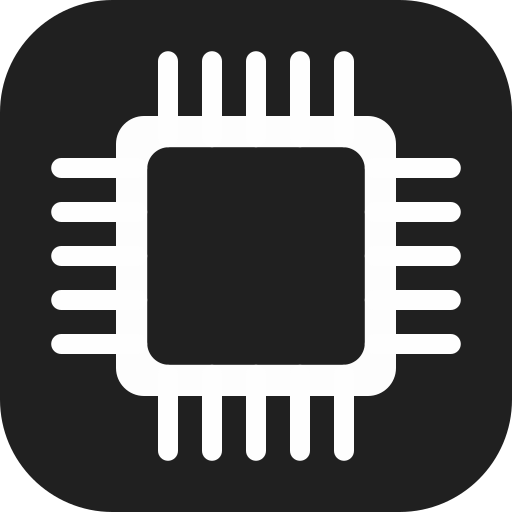

# `CoreLauncher`

CoreLauncher is your universal game launcher. Allowing you to launch games from steam, epic games, and minecraft all in one place.

 
 

## Dependencies

CoreLauncher uses [wry](https://github.com/tauri-apps/wry) for webview rendering and [tray-icon](https://github.com/tauri-apps/tray-icon) for system tray support. Platform-specific dependencies may be required to build the project.

- See [wry's Platform Considerations](https://github.com/tauri-apps/wry#platform-considerations) for webview dependencies.
- See [tray-icon's documentation](https://docs.rs/tray-icon/0.25.1/tray_icon/index.html#dependencies-linuxbsd) for Linux/BSD system tray dependencies.

## Disclaimers

- CoreLauncher is not affiliated with or endorsed by Mojang Studios or Microsoft.
- CoreLauncher is not affiliated with or endorsed by Valve or Steam.
- CoreLauncher is not affiliated with or endorsed by Epic Games.
- Use CoreLauncher at your own risk. The developers are not responsible for any damage or data loss that may occur from using this software.

## License

CoreLauncher is licensed under the [MIT License](LICENSE).
